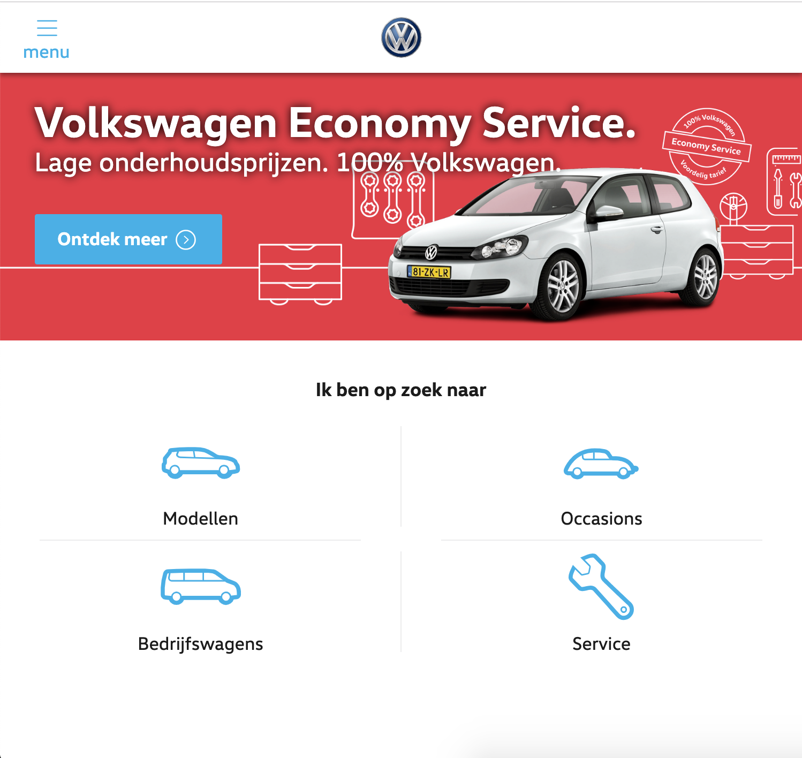

<!--

 __    __   _______  __       __        ______   
|  |  |  | |   ____||  |     |  |      /  __  \  
|  |__|  | |  |__   |  |     |  |     |  |  |  |
|   __   | |   __|  |  |     |  |     |  |  |  |
|  |  |  | |  |____ |  `----.|  `----.|  `--'  |
|__|  |__| |_______||_______||_______| \______/  

.___________. __    __   _______ .______       _______
|           ||  |  |  | |   ____||   _  \     |   ____|
`---|  |----`|  |__|  | |  |__   |  |_)  |    |  |__   
    |  |     |   __   | |   __|  |      /     |   __|  
    |  |     |  |  |  | |  |____ |  |\  \----.|  |____
    |__|     |__|  |__| |_______|| _| `._____||_______|

-->

# Volkswagen.nl

## Inhoud
* [Top 5 optimalisaties](#top-5-optimalisaties)
* [Snelheid optimalisaties](#snelheid-optimalisaties)
* [Focus styles](#focus-styles)
* [Contrast](#contrast)

## Top 5 optimalisaties
1. Afbeeldingen optimaliseren (`.webp`)
2. Precompress alle statische assets met brotli & gzip
3. Voeg een cache control header toe aan alle statische assets
4. Voeg een focus style toe aan alle klikbare elementen
5. Verwijder ongebruikte CSS & JS OF stuur alleen critical CSS & JS en laad dan de rest in

6. Contrast blauw-wit en tekst op afbeeldingen niet goed

## Snelheid optimalisaties
Testen zijn uitgevoerd met een gesimuleerde internetsnelheid van 200/200 kb up/down.  
De volgende tabel bevat de standaardwaarden

| | volkswagen.nl first load | volkswagen.nl reload | Lokaal zonder aanpassingen | Lokaal reload zonder aanpassingen |
| --- | --- | --- | --- | --- |
| Laadtijd | 4.3 min | 4.3s | 2.6 min | 6s |

<!-- | | gzip on the fly | Cache header, page reload | Afbeeldingen in .webp | Ongebruikte css verwijderd | Afbeeldingen uitgeschakeld |
| --- | --- | --- | --- | --- | --- |
| Laadtijd | 2 min | 5s | 1.1 min | 1.1 min | 39s | -->

De totaal bespaarde laadtijd ten opzichte van de lokale website zonder aanpassingen is 1.8 minuten. Deze optimalisatie is behaald door de volgende optimalisaties:
* Afbeeldingen serveren in `.webp` formaat (2.2mb naar 714kb)
* Ongebruikte CSS verwijderen (40kb naar 12kb gzipped naar 10kb brotli)
* Statische assets precompressen (brotli)

Voor snellere herlaad tijden is een caching header toegevoegd aan alle assets.

#### Zwaarste assets
* Afbeeldingen
* Fonts
* JS (scripts.min.js) (echt 21.000 regels js nodig?)
* CSS (styles.min.js) (echt 14.500 regels css nodig?)

| |
| --- |
|  |
|

## Focus styles
Focus styles zijn belangrijk voor mensen die alleen een keyboard kunnen gebruiken. Zonder kunnen ze niet zien op welk element ze zitten.

| Zonder focus style | Met focus style |
| --- | --- |
|  |  |

## Contrast

Het contrast van de knoppen en sommige links (blauw op wit of andersom) is niet voldoende voor slechtzienden.

[Check de contrastscore hier.](color.review/check/FFFFFF-00B1EB)

Ik heb er voor het voorbeeld voor gekozen om binnen de huidige kleur blauw te blijven. Het donkerder maken van die kleur is niet per se mooi maar doet de leesbaarheid wel ten goede.

| Slecht contrast | Voldoende voor koppen |
| --- | --- |
|  [#FFFFFF - #00B1EB](color.review/check/FFFFFF-00B1EB) |  [#FFFFFF - #009FD3](color.review/check/FFFFFF-009FD3) |

| Voldoende grote voor tekst | Voldoende voor alles |
| --- | --- |
|  [#FFFFFF - #007FA9](color.review/check/FFFFFF-007FA9) |  [#FFFFFF - #006080](color.review/check/FFFFFF-006080) |

Dit is hoe het er uit zou zien met aangepaste kleuren.

